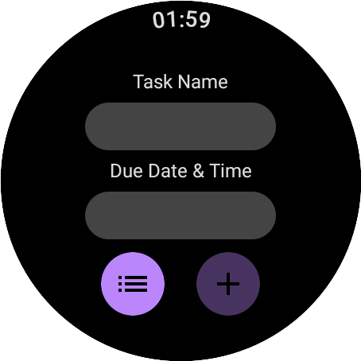
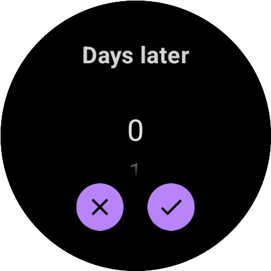
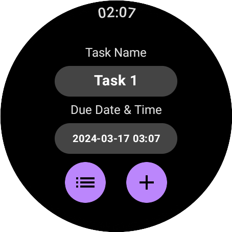
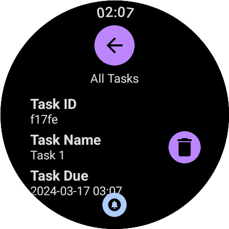
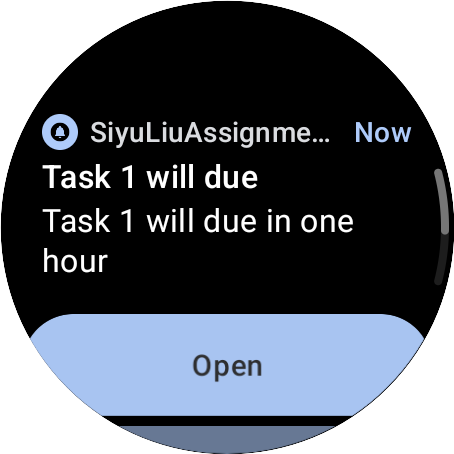
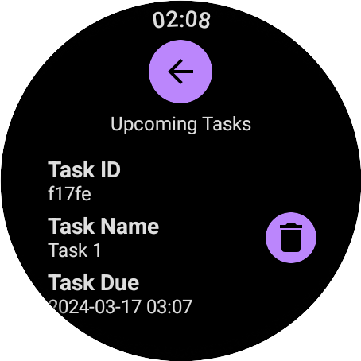

# PROG8790-24W-Sec3-Android-Wear-Assignment2-Notification-Todo-List

The project of this assignment should be a todo list Application with upcoming events' notification functionality. While the requirement doc shows it should be developed by Java, but actually Kotlin is also acceptable, it developed by Kotlin with Jetpack.

## Preview













## Requirements

[Assignment 2 - Android Wear Task Manager- Sec 1.pdf](./doc/Assignment 2 - Android Wear Task Manager- Sec 1.pdf)

## Summary

### The basic steps to push a notification

1、Create a notification channel

```kotlin
val channel = NotificationChannel(
    channelID,
    channelName,
    NotificationManager.IMPORTANCE_DEFAULT
)
NotificationManagerCompat.from(context).createNotificationChannel(channel)
```

2、Every time to push a notification, using NotificationCompat.Builder

```Kotlin
val notificationBuilder = NotificationCompat.Builder(context, this.channelID)
            .setAutoCancel(true)
            .setSmallIcon(R.drawable.notification_icon)
            .setContentTitle(title)
            .setContentText(content)

if (ActivityCompat.checkSelfPermission(context,
        Manifest.permission.POST_NOTIFICATIONS
    ) != PackageManager.PERMISSION_GRANTED) {
        val intent = Intent().apply {
            action = Settings.ACTION_APP_NOTIFICATION_SETTINGS
            putExtra(Settings.EXTRA_APP_PACKAGE, context.packageName)
        }
        startActivity(context, intent, null)
    } else {
        NotificationManagerCompat.from(context).notify(Random.nextInt(), notificationBuilder.build())
    }
}
```
